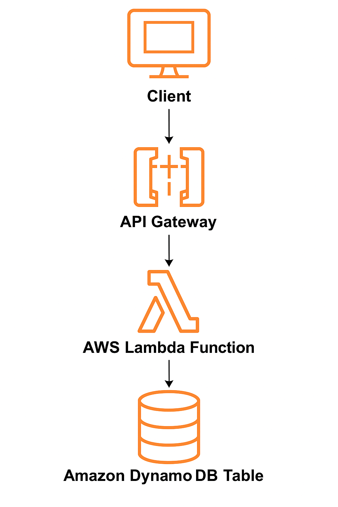

# 🧠 Serverless Text Analyzer (AWS Lambda + API Gateway + DynamoDB)

This project is a **serverless REST API** built using **AWS Lambda**, **API Gateway**, and **DynamoDB**. It receives a text input, analyzes it (e.g., word and character count), and stores the result in a DynamoDB table.

---

## 📌 Features

- Serverless architecture using AWS services
- REST API endpoint using API Gateway
- Text analysis (word count & character count)
- Stores data in a DynamoDB table
- Written in Python using Boto3 SDK
- Error handling and validation built-in

---

## 🧱 Architecture Diagram

****

---

## 🚀 Technologies Used

- **AWS Lambda** – for running serverless backend logic
- **Amazon API Gateway** – for exposing the API endpoint
- **Amazon DynamoDB** – for persistent NoSQL data storage
- **IAM** – for permission management
- **Boto3** – AWS SDK for Python
- **Python 3.11+**

---

## 🛠️ Setup Instructions

### 1. 🗃️ Create DynamoDB Table
- Table Name: `TextAnalysis`
- Primary key: `id` (String)

---

### 2. 🧠 Lambda Function
- AWS console > Lambda 
- Create Function :- 
  * Runtime : Python 3.11
  * Execution role : Create a new role with basic Lambda permission 

Paste the following code into your Lambda function:

- Click **"Deploy"**

### 3. 🔑 IAM Role Permissions
- Attach a policy to your Lambda function role with at least the following permission:
<!--{ 
  "Effect": "Allow",
  "Action": [
    "dynamodb:PutItem"
  ],
  "Resource": "arn:aws:dynamodb:REGION:ACCOUNT_ID:table/TextAnalysis"
}-->

### 4.🌐 API Gateway Setup

- Create a **REST API**.

- Define a **POST method**.

- Integrate it with your **Lambda function**.

- Enable **CORS**.

- Deploy the API to a stage (e.g., Prod).

### 5. 🧪 Testing the API

- Test API Using Two methods:-
    1. Using curl command:- 

 <!-- curl -X POST https://<your-api-id>.execute-api.<region>.amazonaws.com/Prod/analyze \
  -H "Content-Type: application/json" \
  -d '{"text": "Wellcome, To AWS Serverless Text Analyzer API!"}' -->

    
   2. Using Postman :- 

     * Open Postman 

     * **SELECT https request type**

     * **Request type POST**

     * **Enter Url**
        <!-- - https://Your-api-id.execute-api.your-region.amanzonaws.com/Prod/analyze -->

     * **Go To Header Tab**

       - Key :- Enter **Content-Type** 

       - Value :- Enter **application/json**

     * **Go To Body Tab**
       
       - Select **raw** 
          - From the Dropdown Select **JSON** Type Document And Enter this :-
             <!-- {
                   "text": "Wellcome, To AWS Serverless Text Analyzer API!"
                  } -->

**Expected Responce**
<!--{
    "id": "a6a4c1d0-6fce-4669-814c-0de35308618d",
    "text": "Wellcome, To AWS Serverless Text Analyzer API!",
    "word_count": 7,
    "char_count": 46
} -->

